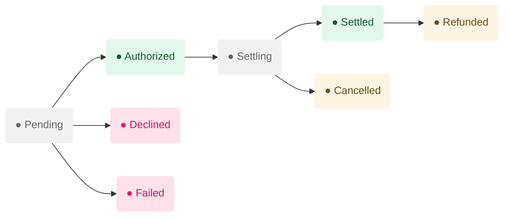
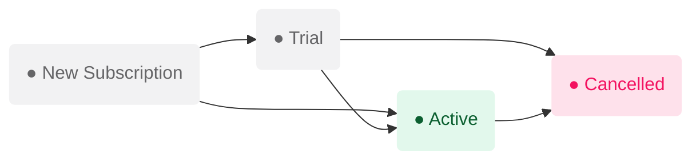

## Payment lifecycle

All PayNext payments conform to a unified payment lifecycle, which makes them work the same way regardless of the payment services you need.

A payment always has a **payment status**. Each payment will progress through some combination of the statuses listed below on their way through your Workflow.

A newly-created payment is assigned the status **PENDING**.

| Status         | Description                                                                                                                                                                           |
| :------------- | :------------------------------------------------------------------------------------------------------------------------------------------------------------------------------------ |
| **PENDING**    | The payment is awaiting a subsequent action or callback. This usually occurs with asynchronous processors. Prepare for this contingency by setting up Webhooks.                       |
| **AUTHORIZED** | The processor has authorized the payment and no further status-altering actions have been defined in your Workflow.                                                                   |
| **DECLINED**   | The processor has declined the payment and no further status-altering actions have been defined in your Workflow. You may want to consider retrying certain declined payments.        |
| **FAILED**     | This usually occurs when there is a processor gateway issue, such as a service disruption. Set up retries and fallbacks to mitigate failures.                                         |
| **CANCELLED**  | The payment was canceled prior to it being settled.                                                                                                                                   |
| **SETTLING**   | The payment has been submitted for settlement and funds will be settled later. This usually occurs with asynchronous processors. Prepare for this contingency by setting up Webhooks. |
| **REFUNDED**   | The transaction was successfully refunded after it had been processed and settled.                                                                                                    |

## Subscription lifecycle

### Billing Retry

If the customer’s recurrent payment is Declined or Failed, the renewal fails and the user’s subscription enters a billing retry state, where the PayNext attempts to collect payment for up to 30 days. This billing retry lowers the rate of involuntary churn and prevents the need to re-acquire subscribers if they churned. If the user is recovered within the 30 days, the new billing date is established on the date of recovery and subsequent renewal dates are based on this new billing date, as shown in the figure below.

### Subscription Statuses

| Status                              | Description                                                                                                                                                                                                                                                                                                                         |
| :---------------------------------- | :---------------------------------------------------------------------------------------------------------------------------------------------------------------------------------------------------------------------------------------------------------------------------------------------------------------------------------- |
| **<Tooltip tip="">trial</Tooltip>** | The subscription is currently in a trial period and you can safely provision your product for your customer. The subscription transitions automatically to active when a customer makes the first payment.                                                                                                                          |
| **active**                          | The subscription is in good standing. For past_due subscriptions, paying the latest due payment transitions the subscription to active.                                                                                                                                                                                             |
| **past_due**                        | Payment on the latest recurrent payment was either Declined or Failed. The subscription stops creating new invoices. If the due payment is still unpaid after all attempted billing retries, subscription moves to canceled. To move the subscription to active, customer needs to pay the most recent invoice before its due date. |
| **canceled**                        | The subscription was cancelled. During cancellation, automatic collection for all due payments is disabled. This is a terminal state that can't be updated.                                                                                                                                                                         |